_`Github Repo`_
https://github.com/EpicFate/hh.ru_Tests

**Запуск тестов организован в Jenkins.**
_`Jenkins job`_ https://jenkins.autotests.cloud/job/c03-hh.ru/

## Technology Stack
**Java, Gradle, Junit5, Selenide, Rest-Assured, Jenkins, Selenoid, Allure TestOps, Allure Reports, Telegram Bot, Jira.**

## `Screenshots`

### *Selenoid:*
**Для контейнеризации тестов использован Selenoid.**

**Можно запускать несколько браузеров одновременно (также работает локально без Selenoid)**

**Selenoid видео:**

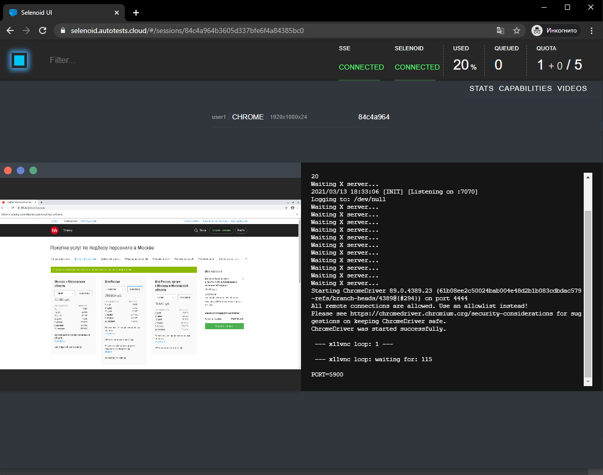

### *Selenoid:*

## **Паралельный запуск**

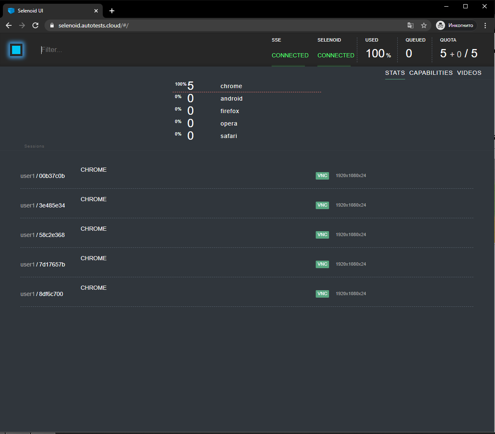

### *Allure TestOps:*
**В качестве тест менжемент системы использован Allure TestOps. Есть интеграция с Jira**
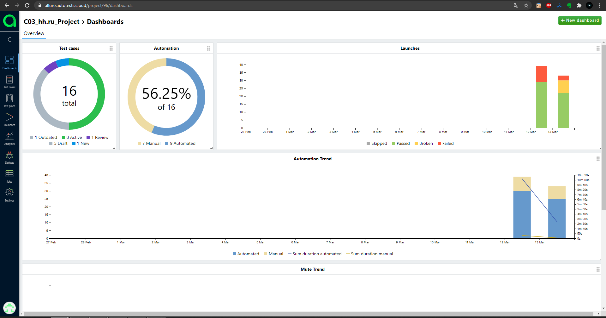
**Тест кейсы, ручные и автоматизированные**
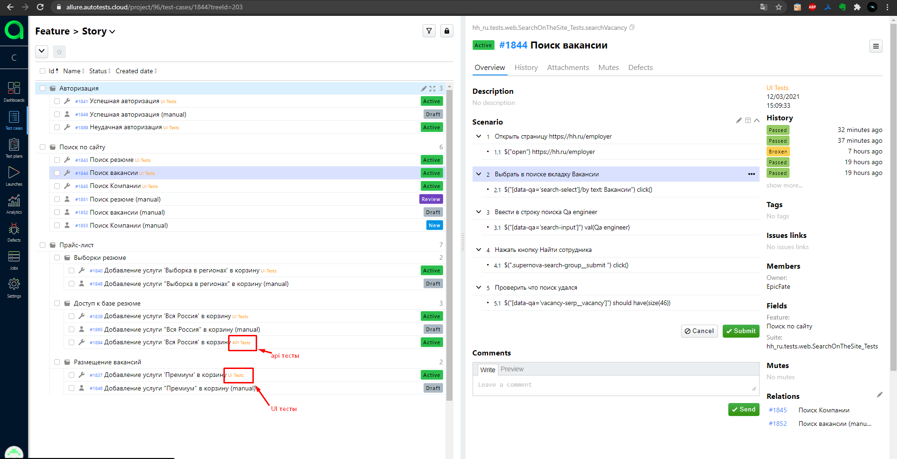
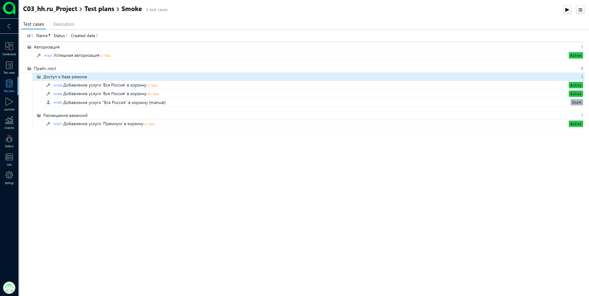

### *Allure Report:*
_Отчет о прохождении тестов Allure Report можно посмотреть по ссылке:_ https://jenkins.autotests.cloud/job/c03-hh.ru/25/allure/#

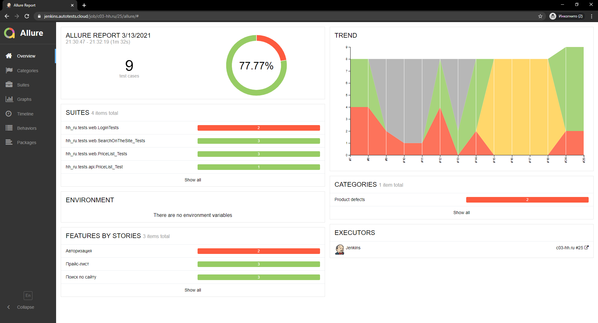
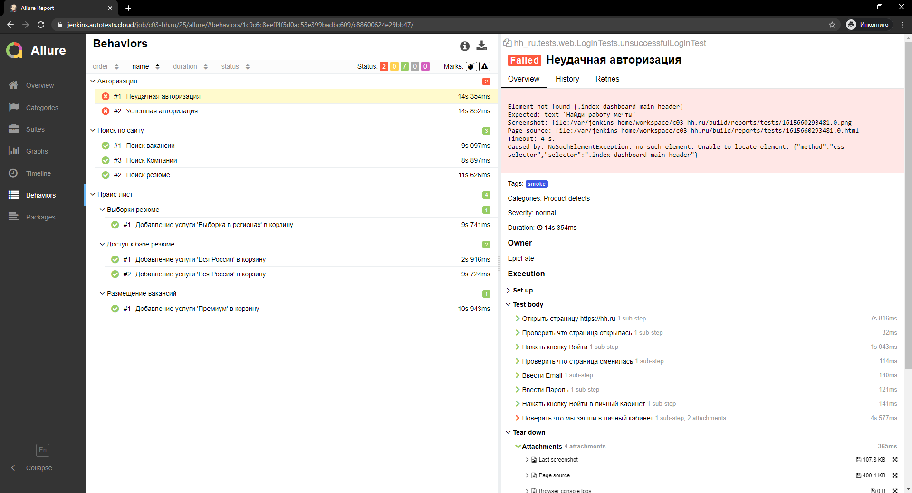
### *Allure Report:*
**К отчетам прикреплены скриншот и видео о прохождении теста.**

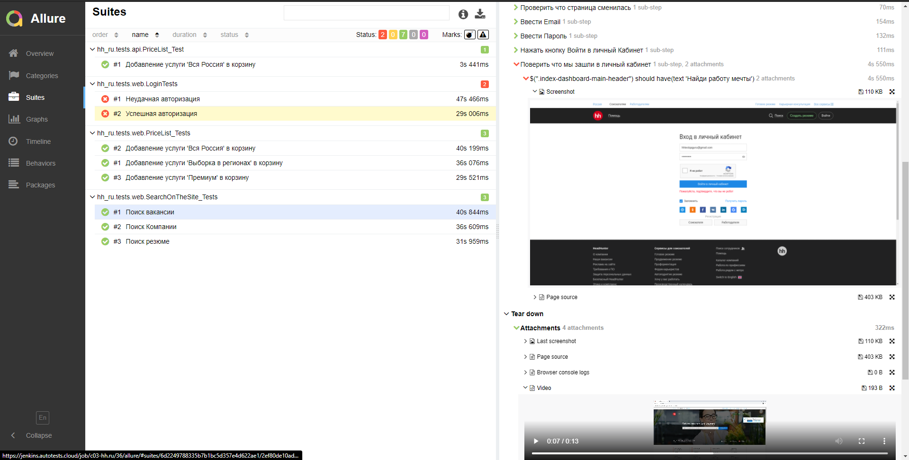

**Красивые отчеты для API тестов.**
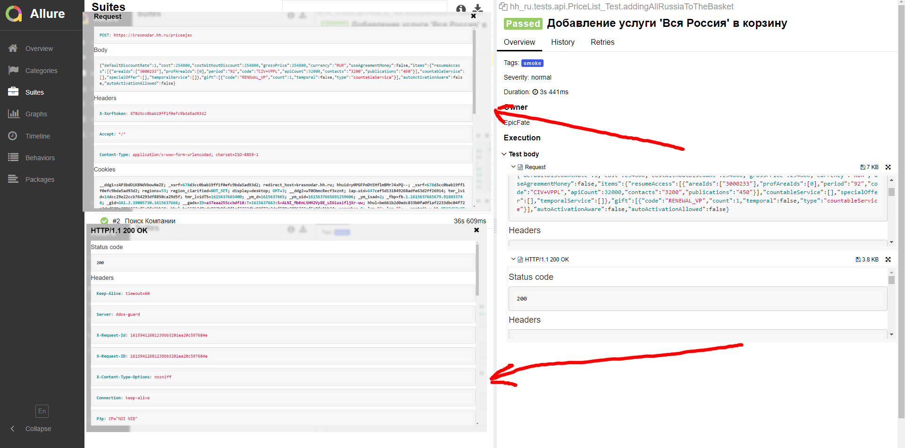

### *Jira:*
**Интеграция _Jira_ c _Allure TestOps_**

Отображаются тесты которые указаны в _**тест плане**_, есть ссылка на запуск тестов из _**Allure TestOps**_
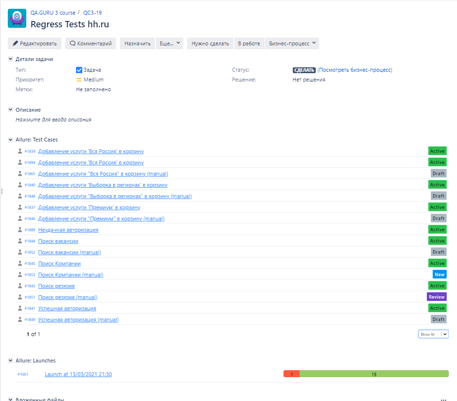

### *Telegram notification:*

**После окончания тестов результаты отправляются в Telegram.**

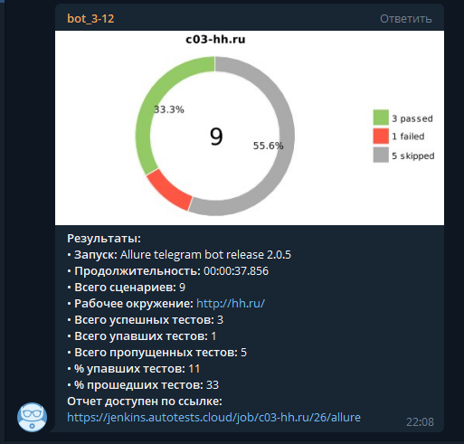
