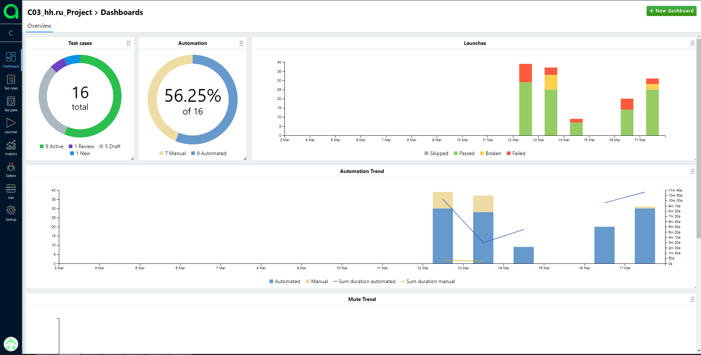

_`Github Repo`_
https://github.com/EpicFate/hh.ru_Tests

_`Jenkins job`_
https://jenkins.autotests.cloud/job/c03-hh.ru/

## Technology Stack
**Java, Selenide, Rest-Assured, Junit5, Gradle, Allure Reports, Allure TestOps, Jenkins, Selenoid, Telegram Bot, Jira.**
  

## `Screenshots`

### *Selenoid:*

### *Allure Report:*
_Ссылкана на отчет:_ https://jenkins.autotests.cloud/job/c03-hh.ru/25/allure/#

### *Allure TestOps:*

### *Jira:*

### *Telegram notification:*

